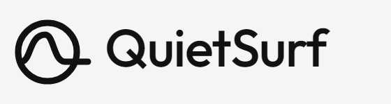

<p>
  <picture>
    <source media="(prefers-color-scheme: dark)" srcset="brand/wordmark-dark.png">
    
  </picture>
</p>

<p>
  <strong>Distraction-free browsing, on your terms.</strong><br>
  Hide the feed, the sidebar, the endless scroll — one toggle at a time, per site.
</p>

<p>
  <em>Free forever. No account. No subscription. No daily limit. No tracking.</em>
</p>

QuietSurf started as a YouTube-only extension (built as a no-paywall
replacement for **DF Tube**, aiming to beat **Unhook** on granularity and
resilience — see [`docs/SPEC.md`](docs/SPEC.md)) and became a site-agnostic
core engine plus a **pack** per site, with YouTube as the first pack rather
than the special case.

## What it does

Every site QuietSurf supports gets its own **pack**: its own toggles, its own
modes, its own options-page section. Nothing is granted until you turn a site
on — see [Install](#install-development).

**YouTube** — 41 toggles across 9 groups: the home feed and its topic chips,
the watch-page sidebar, end-of-video wall, in-video cards, auto-generated
mixes, every Shorts entry point (including a real `/shorts/ID` → `/watch`
redirect, not just the shelves), comments (hide outright or collapse behind
a button), autoplay, ambient mode, view/like counts, merch shelves, the left
nav rail, search autocomplete and promoted results, grayscale thumbnails, and
pause-on-tab-switch. Full list: [`docs/FEATURES.md`](docs/FEATURES.md).

**Reddit** — 6 starting toggles: promoted posts, recommended-community
inline cards, the Trending Today / Popular Communities sidebar module, the
whole right sidebar, award & coin prompts, and comment collapse. Newer than
the YouTube pack and its selectors are marked `unverified` pending a live
audit from a network that can reach reddit.com — see
[`docs/DECISIONS.md`](docs/DECISIONS.md) D15.

**LinkedIn** — 8 starting toggles: promoted posts, "because you follow"
discovery cards, "People You May Know", the LinkedIn News sidebar module, the
whole right sidebar, Premium upsell banners, the notification badge, and
comment collapse. Everything here needs a signed-in session to even exist —
LinkedIn's feed redirects a signed-out visitor straight to a sign-in wall —
so every toggle is marked `needs-account` and unverified against a real
session. See [`docs/DECISIONS.md`](docs/DECISIONS.md) D18.

## Modes, not a master switch

Most blockers make you choose between "focused" and "normal" — so the first
time you need a recommendation, you disable the extension and never turn it
back on. QuietSurf has per-site modes instead:

- **Light** — the noisiest stuff gone, the rest of the site intact.
- **Deep Focus** — search-and-read/watch only.
- **Custom** — your own set of toggles.
- YouTube also has **Music** — playlists, mixes and related tracks
  deliberately *stay*. Other blockers break music listening because they
  treat "related video" as always-bad. A pack declares whichever modes suit
  its site; nothing forces a fourth mode nobody asked for.

Switch from the popup, cycle YouTube's with `Alt+Shift+Q`, or set a schedule
so a mode turns itself on during work hours. And when you genuinely need to
see something: `Alt+Shift+P` reveals everything for 30 seconds, then re-hides
itself. You never have to disable the extension.

## Install (development)

Not on the Chrome Web Store yet — load it unpacked:

1. `chrome://extensions` → enable **Developer mode**
2. **Load unpacked** → select the `src/` folder
3. Open the extension's popup on a site it supports and pick a mode — this
   is what asks Chrome for that site's permission. Nothing is granted at
   install; each site is opt-in, one at a time, the first time you turn it on.

No build step. `src/` is the extension.

## Supported sites

| Pack | Toggles | Status |
|---|---|---|
| YouTube | 41 | selectors verified live |
| Reddit | 6 | selectors unverified — see D15 |
| LinkedIn | 8 | needs a signed-in session to verify — see D18 |

## Adding a site pack

The pack contract is one file: `src/packs/<id>.js` exports `{ id, label,
hosts, pages, groups, features, handlers, modes }`, documented in full at the
top of [`src/packs/youtube.js`](src/packs/youtube.js) and in
[`docs/ARCHITECTURE.md`](docs/ARCHITECTURE.md). `src/core/` never needs to
change — that's the whole point of the split.

Here's what actually happened adding the Reddit pack, as a worked example:

1. **Write the pack.** [`src/packs/reddit.js`](src/packs/reddit.js) — six
   registry entries, its own `pages` classifier (`home`, `subreddit`,
   `comments`, `search`), and two modes (`light`, `deep_focus` — the generic
   names every pack after YouTube uses, see `docs/DECISIONS.md` D15).
2. **Find real selectors.** Use the `site-selector-audit` skill (or its
   three-tier method by hand): prefer a framework's own component names,
   then ids/attributes, then class names as a last resort — and mark
   anything you couldn't check against the live site `verified: 'unverified'`
   rather than guessing at `'live'`. This step is what turned up the one
   genuine finding of the whole exercise: a comment-collapse handler that
   turned out to be identical to YouTube's except for one selector, which
   got pulled into `core/dom.js` as `collapseWithReveal()` — see D15.
3. **Register it.** Add an entry to `QS_PACKS` in
   [`src/background/pack-scripts.js`](src/background/pack-scripts.js) (its
   host pattern and file list), add that host pattern to
   `optional_host_permissions` in `src/manifest.json`, and add a
   `<script src="../packs/reddit.js">` tag to `popup/popup.html` and
   `options/options.html`, after every pack already listed there.
4. **Wire up tests.** Add `'reddit'` to the `PACK_IDS` array in
   `tests/registry.spec.js` and `tests/engine.spec.js` — both are
   parameterised over every pack already, so that's the only change either
   file needed.
5. **Report what you found.** What selectors you could verify live and
   which you couldn't, what (if anything) revealed a core/pack boundary that
   needed fixing rather than a special case, and what you'd do differently
   for the next one. `docs/DECISIONS.md` D15 is that report for Reddit.

## Development

```bash
npm install           # Playwright, for tests and brand-asset generation — the extension has no build step
npm run test          # offline tests, no network
npm run check         # tests + release gate
npm run test:live     # YouTube pack's selector health check against real YouTube
npm run gen:features  # regenerate docs/FEATURES.md from the YouTube pack's registry
npm run gen:brand     # regenerate every brand asset (icons, wordmark, promo tile) from tools/gen-brand.mjs
```

`npm run test` loads the real unpacked extension into Chromium and verifies
it boots correctly and that nothing injects into any site before that site's
permission is granted — no network access required. `npm run test:live` is
the one that checks the YouTube pack's selectors still match YouTube's actual
markup; run it before every release.

Everything starts at a pack file — `src/packs/youtube.js` is the reference
one. The options page, the injected CSS, the behaviour dispatch and the docs
are all generated from a pack's registry. Read [`CLAUDE.md`](CLAUDE.md)
before changing anything.

## Privacy

QuietSurf collects nothing. There is no server, no analytics, no telemetry,
and no network request of any kind anywhere in the codebase — the source is
public and unminified so you can check that yourself. Every site is opt-in:
nothing is granted at install, and turning a site on asks Chrome's own
permission prompt for that site alone. Full policy:
[`docs/PRIVACY.md`](docs/PRIVACY.md).

## Licence

MIT for the code. The vendored [Outfit](https://github.com/Outfitio/Outfit-Fonts)
typeface in `brand/` is SIL Open Font License 1.1 — see `brand/OFL-outfit.txt`.

---

Not affiliated with YouTube, Google, Reddit, LinkedIn, or any site this
extension supports.
