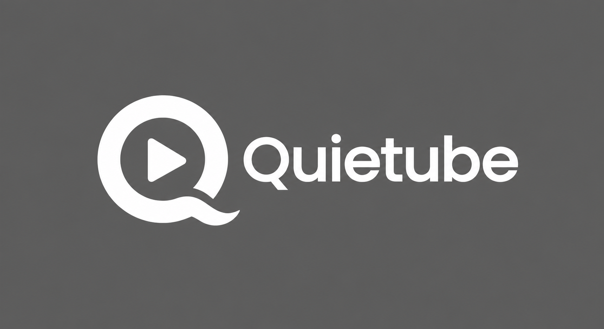

<p>
  
</p>

# QuietTube

<p>
  <strong>Distraction-free YouTube, on your terms.</strong><br>
  Hide the feed, sidebar, Shorts, comments and 35 other things on YouTube.
</p>

<p>
  <em>Free forever. No account. No subscription. No daily limit. No tracking.</em>
</p>

Built as a replacement for DF Tube, which now limits its free tier to one hour
a day.

## What makes it different

- **Modes, not a master switch.** Study / Music / Casual presets, cycled with
  `Alt+Shift+Q`, optionally auto-switching by time of day. Music mode
  deliberately keeps playlists and related tracks — every other blocker breaks
  music listening.
- **Peek.** `Alt+Shift+P` reveals everything for 30 seconds, then it re-hides
  itself. You never have to disable the extension to see one thing.
- **Shorts actually gone.** `/shorts/ID` is rewritten to the normal player, so
  a link someone sends you still works but the swipe feed never loads. Others
  only hide the shelves.
- **No flash.** The stylesheet is injected synchronously before first paint, so
  you never see the recommendation wall for a frame. See
  `docs/ARCHITECTURE.md § No-flash`.
- **One permission.** `storage`. Nothing else. No network requests exist in the
  codebase at all.
- **40+ toggles**, each with an honest fragility rating.

Full list: [`docs/FEATURES.md`](docs/FEATURES.md).
Comparison with DF Tube and Unhook: [`docs/SPEC.md`](docs/SPEC.md).

## Install (development)

1. `chrome://extensions` → enable **Developer mode**
2. **Load unpacked** → select the `src/` folder
3. Open YouTube

No build step. `src/` is the extension.

## Development

```bash
npm install           # Playwright, for tests only — the extension has no build step
npm run test          # 60 offline tests, ~10s (no network)
npm run check         # tests + release gate
npm run test:live     # selector health check against real YouTube
npm run gen:features  # regenerate docs/FEATURES.md from the registry
npm run gen:icons     # regenerate src/icons/*.png
```

`npm run test` loads the real unpacked extension into Chromium and verifies it
boots, injects, and hides the home feed — no YouTube access required.
`npm run test:live` is the one that checks the selectors still match YouTube's
actual markup; run it before every release.

Everything starts at [`src/lib/registry.js`](src/lib/registry.js) — the options
page, the injected CSS, the behaviour dispatch and the docs are all generated
from it. Read [`CLAUDE.md`](CLAUDE.md) before changing anything.

## Licence

MIT.

---

Not affiliated with YouTube or Google. YouTube is a trademark of Google LLC.
